
This file describes how to construct the Jet chassis using Actobotics

## Chassis Frame

1.  Locate the Actobotics component 'dual mount A' along with 4 6-32x1/4" screws.
  
    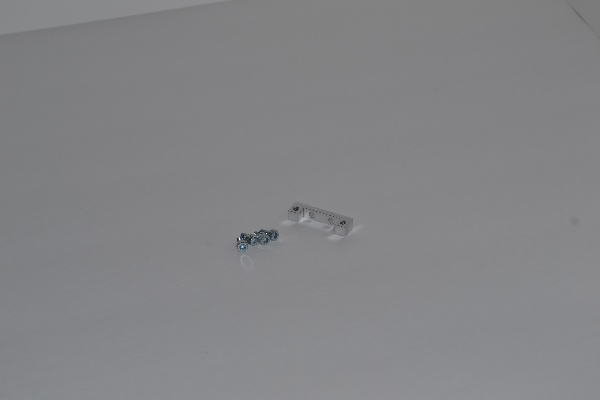

2.  Attach the 'dual mount A' into the end of a 12" Actobotics channel.  The mount
should sit flush with the end of the channel.

    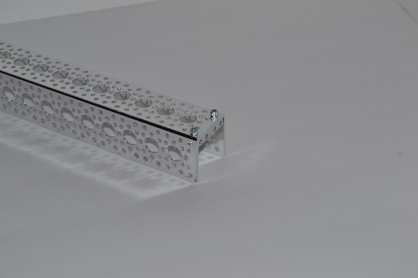

3.  Turn the channel on its side and attach the channel to another 12" channel.  One channel
should be open to the side and the other channel should be open downward.

    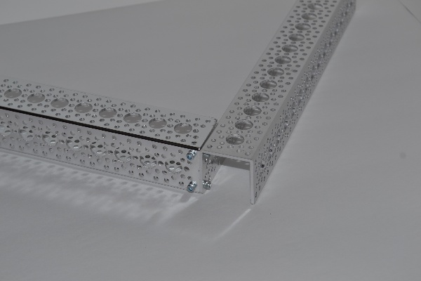

    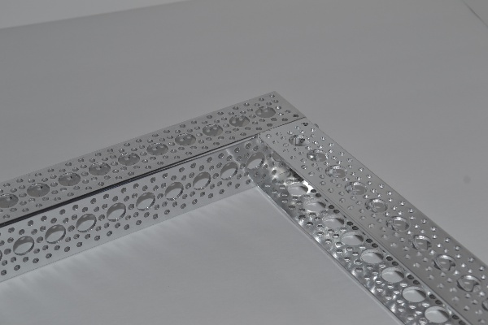

4.  Repeat with another 12" channel to obtain a U-shaped structure.  2 of the channel pieces
should be open to the center.

    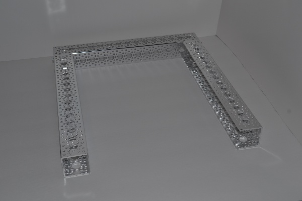

5.  Locate the quad pillow block along with 4 6-32x1/4" screws.

    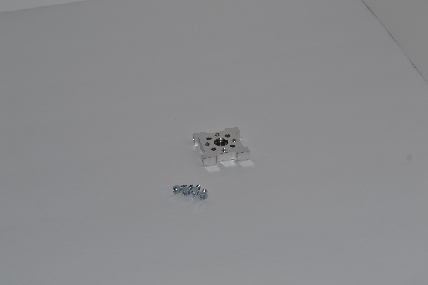

6.  Attach the quad pillow block to the center of a 12" channel.  This quad pillow block
will be the lower bearing for the caster wheels.

    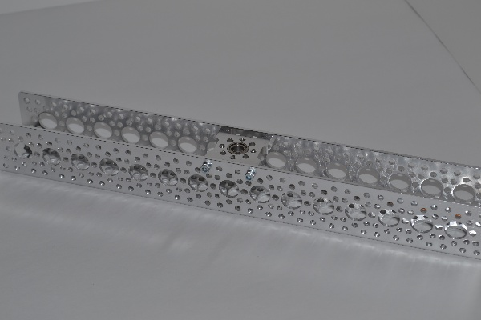

7.  Attach that the channel with the quad pillow block to the other 3 channel.  This will
complete the rectangular frame.  The front of the robot will be the channel without the
quad pillow block.

    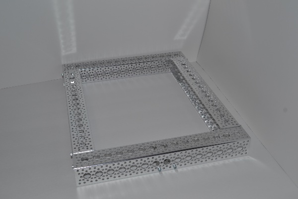

    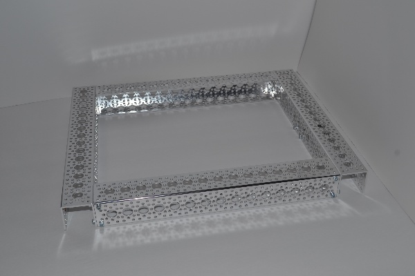

## Motors

1.  For the motors, you will need the 50:1 12 gearmotor and the 37mm clamping motor
mount.

    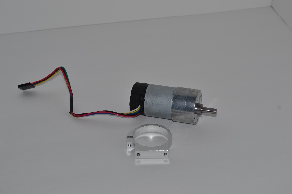

2.  Secure the motor into the mount.  Spin the motor in the mount so that the shaft is
as close as possible to the flat part of the motor mount.

    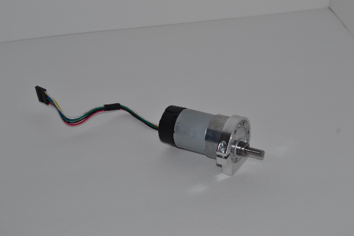

## Wheels

1.  Attach hub adaptor D to the wheels.

    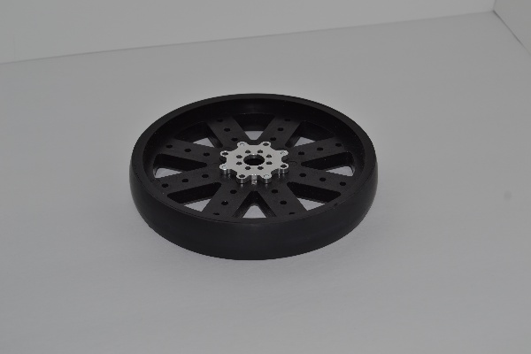

    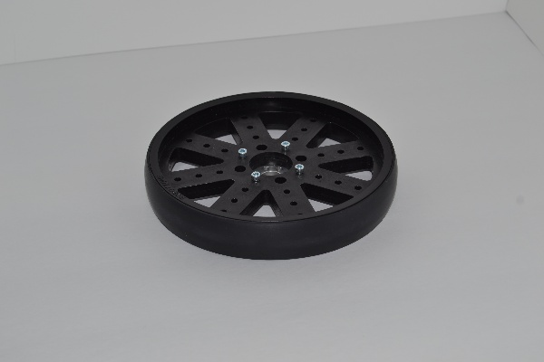

2.  Attach the clamping hub to the hub adaptor.

    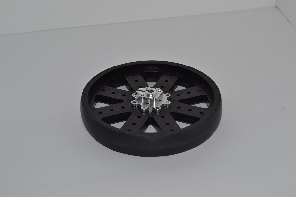

3.  Attach the motor shaft to the clamping hub.  Repeat the steps for the second
wheel and motor.

    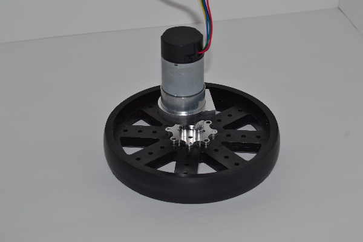

## Caster Wheel

1.  Connect the 2 1/4" parallel tube clamps to the 1.5" channel as shown.

    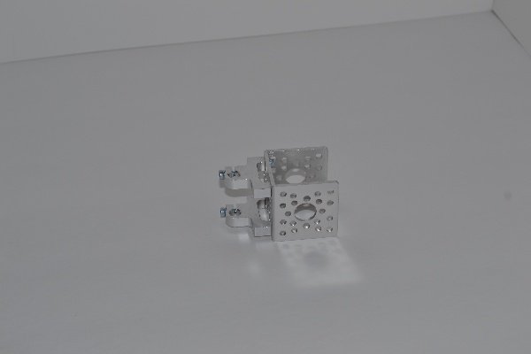

2.  Connect 8mm flanged standoff A to the 1.5" channel.

    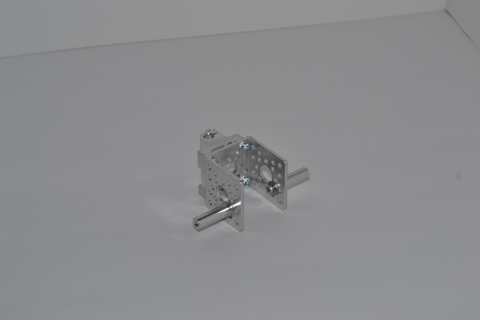

3.  Secure the 5" shaft to the parallel tube clamps.  Also install the 1/4" shaft
clamp collar on the 1/4" shafting.  The lip edge of the clamp collar should face up.

    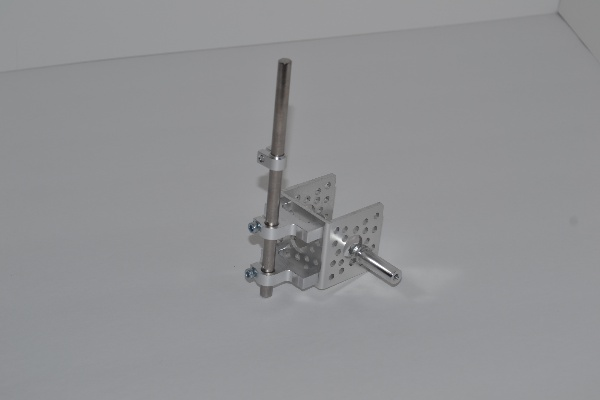

4.  Install the skate wheels on to the standoffs.

    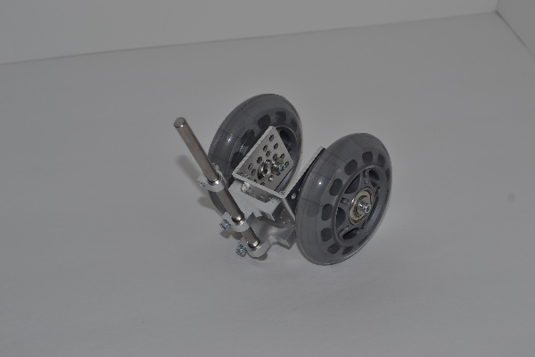

## Final Assembly

1.  Attach the motor mounts to the side channel of the frame.

    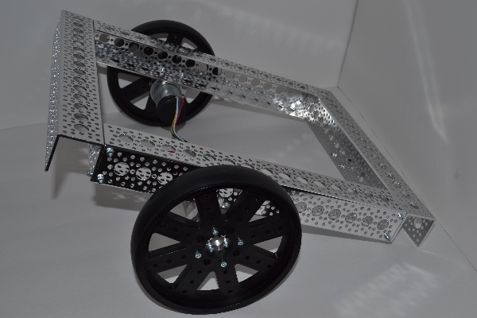

2.  Attach the caster to the frame.  Use a flanged bearing as the top bearing and
secure the caster with a 1/4" shaft clamping collar.

    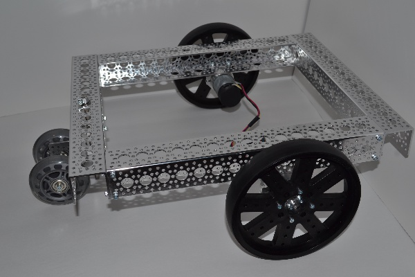

    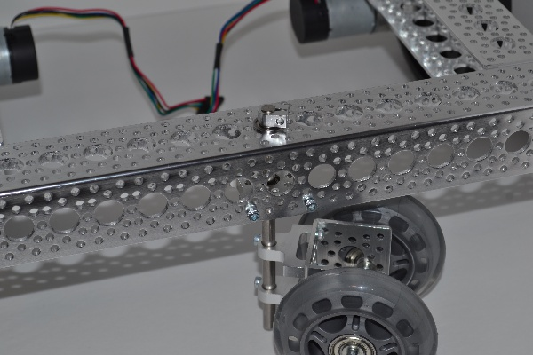

    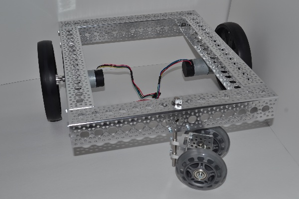