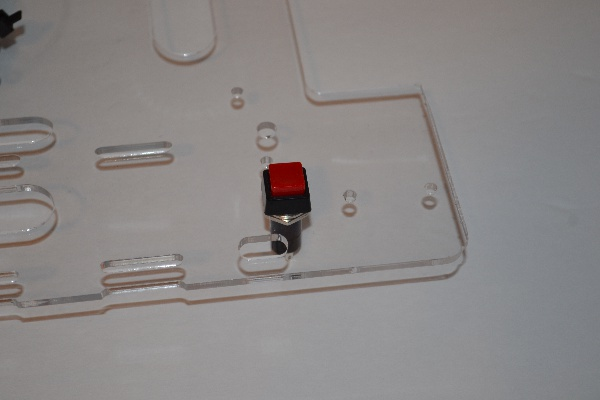
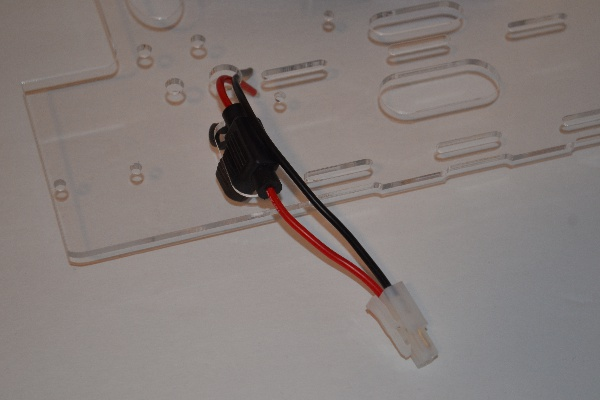
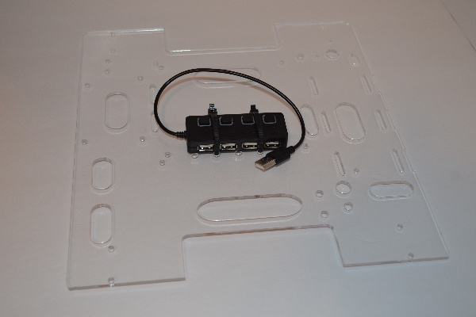
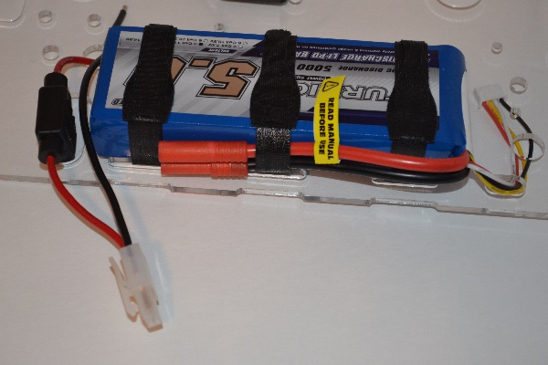
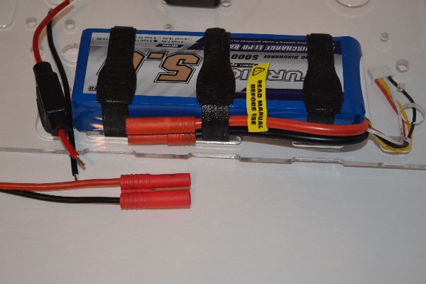
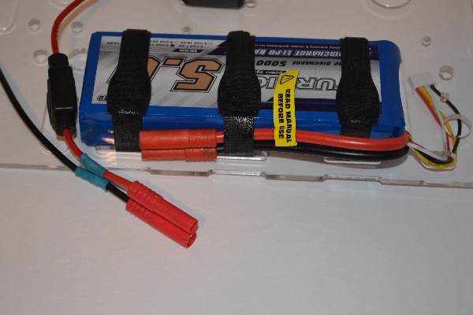
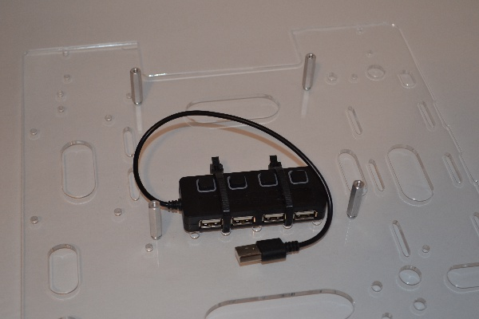
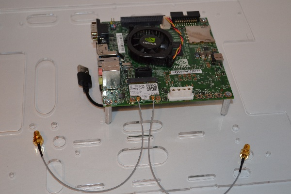



This file describes how to connect the various electronics on Jet.  The
steps are listed in the recommended order to make assembly easier.

Since Jet is constructed from components purchased from various vendors, there
will be some assembly required in order to have a completed robot.  Specifically,
soldering is required in attaching some of the robot wiring.  If you are not familiar
with soldering, please read over the following soldering tutorials:

https://learn.sparkfun.com/tutorials/how-to-solder---through-hole-soldering

http://www.ladyada.net/learn/soldering/thm.html

## Tools

- soldering iron
- solder
- wire cutter
- wire stripper
- heat gun for heat shrink
- small screwdrivers

### 1. Power Switch

This is the main power switch that connects the battery to the Jetson TK1 and the
motors.  

* Attach the power switch to the ABS mounting plate.

  

* Insert the fuse into the appropriate hole in the plate.

  

* Run the red/black wire ends into the wire hole
* Measure the distance from the end of the red wire to one of the contacts of the power
switch.  
* Cut a piece of the red 16AWG stranded wire and solder the ends to the fuse wire
and the power switch contact

### 2. USB Hub

The USB hub will be used to connect the Jetson TK1 with the Arduino Mega and the
Logitech camera.  Install the USB hub into the appropriate holes and secure the hub
using cable ties.  The hub will reside underneath the Jetson TK1.

  

### 3. Battery and Battery Connector

The battery used with Jet is a 3S (11.1V) Li-Po battery.  These
batteries can be dangerous and must be used with an appropriate Li-Po
battery charger.

* Temporarily strap on the battery using Velcro wire wrap ties.  It will take 3 ties
and use the middle ties to hold down the red HXT battery connector.

  

* The next step is to replace the white plastic Tamiya connector on the fuse with a red HXT
connector.  Measure the approximate length of the fuse terminal cable and cut off the Tamiya
connector.

  

* Solder on the new HXT connector and heat shrink the joints so that no solder joints
are exposed.

  

* Check that the new HXT connector fits with the battery connector.
* Remove the battery

### 3. Mount the Jetson TK1

The Jetson TK1 will sit above the USB hub.

* Screw the 1" 4-40 hex standoffs to the mounting plate.

  

* Once the spacers are secure, attach the Jetson TK1 to the standoffs using 4-40 screw.

  

### 4. Mount the Arduino Mega

The Arduino Mega should be mounted in the same way as the Jetson TK1.  The standoffs for the
Arduino Mega are 1/2" tall.

### 5. Install the Wireless Card and Antenna

The wireless card is a mini-PCIe card that attaches to the Jetson TK1.

* Plug in the wireless card and screw in the card using 2 screws.

  

* Connect the 2 antenna to the wireless card.
* Run the antenna wires through the provided hole in the mounting plate and screw in
the antenna.

  